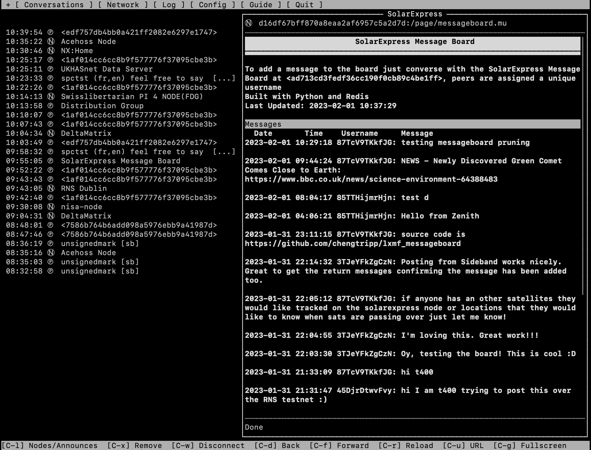

# lxmf_messageboard Nachrichten Pinnwand
Einfaches Message Board, das auf einem NomadNet-Knoten gehostet werden kann. Nachrichten können durch "Konversation" mit einem eindeutigen Peer gepostet werden, alle Nachrichten werden dann an das Message Board weitergeleitet.

## Wie benutze ich es?
Ein Benutzer kann Nachrichten an die Pinnwand senden, indem er einen Chat mit dem Pinnwand-Peer startet. Ihm wird ein Benutzername zugewiesen (basierend auf den ersten 5 Zeichen seiner Adresse) und seine Nachrichten werden direkt zur Pinnwand hinzugefügt. Das Message Board kann auf einer Seite angezeigt werden, die von einem NomadNet-Knoten gehostet wird.

Ein Beispiel für ein Message Board findet sich im Reticulum Testnet, das auf dem SolarExpress-Knoten `<d16df67bff870a8eaa2af6957c5a2d7d>` und dem Message Board Peer `<ad713cd3fedf36cc190f0cb89c4be1ff>` gehostet wird.

## Wie funktioniert es?
Die Messageboard-Seite selbst wird auf einem NomadNet-Knoten gehostet, Sie können die message_board.mu in das pages-Verzeichnis legen. Sie können dann das Skript message_board.py ausführen, das den Peer bereitstellt, an den die Benutzer Nachrichten senden können. Die beiden Teile werden mit umsgpack und einem flachen Dateisystem, ähnlich wie bei NomadNet und Reticulum, zusammengefügt und laufen im Hintergrund.

## Wie richte ich es ein?
* Aktivieren Sie das Knoten-Hosting in NomadNet.
* Legen Sie die Datei `message_board.mu` in das Verzeichnis `pages` in der Konfigurationsdatei für `NomadNet`. Bearbeiten Sie die Datei, um sie von der Standardseite aus anzupassen.
* Starten Sie das Skript `message_board.py` (`python3 message_board.py` entweder in einem `screen` oder als Systemdienst), dieses Skript benutzt `NomadNet` und `RNS` Bibliotheken und hat keine zusätzlichen Bibliotheken, die installiert werden müssen. Notieren Sie sich die Adresse des Message Boards, sie wird beim Start des Boards ausgegeben. Sie können diese Adresse dann in der Datei `message_board.mu` platzieren, um es den Benutzern zu erleichtern, mit dem Board zu interagieren.

## Credits
* Die Sende- und Empfangsfunktionen in message_board.py basieren auf Beispielen, die im Reticulum Matrix Channel von [Mark](https://github.com/markqvist) veröffentlicht wurden.